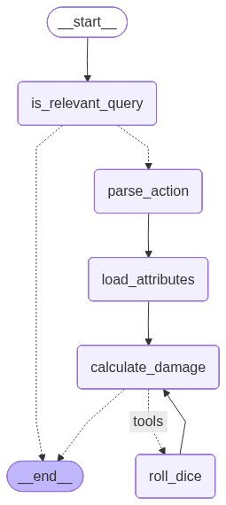

# Making DnD combat easy with an Auto-Damage Calculator

Rolling for damage / effects in DnD combat is infamously complex and slows down the game. The using DnD Beyond / Roll20 still burdens the player with manual damage roll clicks and requires players to have perfect knowledge of character stats / feats. Additionally, these systems are not flexible to homebrew mechanics / items. They also take away from the player experience by unintentionally promoting online distractions which makes it difficult for players to be "present" during the session. 

We need an automated system that seamlessly integrates into the role-playing experience, does not allow for other distractions, and takes administrative burden away from DMs. Additionally, the system must be flexible to an ever-evolving campaign and generalizable to any (homebrew) campaign.

We present DnD-Auto-Damage (DaD), an LLM-driven agentic workflow that addresses these limitations in managing combat logistics. Notable DaD features include
- User can add any additional attributes / actions / items / spells to json files that allow for combat flexibility and specificity
- Stateful matching of user prompts and user-added json entries
- State persistence so that combat can pick-up where it left off
- Tool usage so that players can feel assured that a real RNG is rolling hit die



## Set up

### Create venv and install dependencies
```sh
python -m venv dnd_auto_dmg
source dnd_auto_dmg/bin/activate
pip install -r requirements.txt
```

## Set up OpenAI Keys
DaD uses ChatGPT-4o as the default model with support coming to different models in the future. API calls to ChatGPT generally require payment on-file and can be configured on OpenAI's API [website](https://openai.com/api/)


### Environment variables

### OpenAI Payment